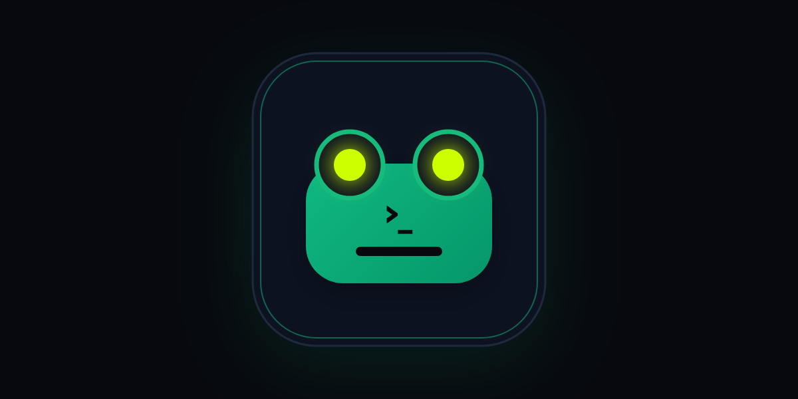

<div align="center">



# toad — Declarative Design DSL Compiler & Exporter

**Code Your Canvas. Design at the speed of code.**

[](https://opensource.org/licenses/MIT)
[](https://nodejs.org)
[](./tests)
[](https://github.com/razy-me/toad)
[](./website)

<p align="center">
  A high-performance declarative Domain-Specific Language (DSL) that compiles structured <code>.toad</code> design files into pixel-accurate multi-scale images (<b>PNG</b>, <b>JPG</b>, <b>WebP</b>), scalable vector graphics (<b>SVG</b>), and native layered Photoshop documents (<b>PSD</b>) with editable vector shapes, gradients, and layer styles.
</p>

[Quickstart](#-quickstart) • [Features](#-features) • [CLI Reference](#-cli-reference) • [Documentation](#-documentation--the-seed) • [Website](#-website--playground) • [Templates](#-production-templates)

</div>

---

## ✨ Features

- 🎨 **Declarative DSL Syntax:** Human-readable syntax with scoped variables (`>primary = #3b82f6;`), directives (`@import`, `@font`), reusable components (`component Button(...)`), component slots (`slot;`), and multi-canvas artboards (`canvas "Front" { ... } canvas "Back" { ... }`).
- 🚀 **Zero-Config Scaffolding:** Create ready-to-run projects instantly using `toad init` with automated directory structure and starter designs.
- ⚡ **Autonomous File Resolver:** Run `toad <name>` from any directory without hunting down file paths or extensions.
- 🔄 **Live Hot Reload & Web Preview:** Run `toad <name> -w` or `toad dev <name>` to launch an instant browser preview with Server-Sent Events (SSE), live reloads on change, zoom controls, and a 1-click "Open Folder" action.
- 📐 **Relational Positioning DAG:** Position elements relationally (`at: below #title offset 16px;`, `at: center of canvas;`), flow items sequentially with flex `stack` and `grid`, and take advantage of `fill` and `hug` auto-sizing.
- 🖨️ **Print Prepress & Bleed:** Physical units (`mm`, `cm`, `in`, `pt`), print metadata (`dpi`, `bleed`, `crop-marks`, `color-mode`), automated Media/Trim Box expansion, and corner crop marks with registration crosshairs.
- 🧮 **Math & Expressions:** Built-in `calc(...)` (e.g. `calc(100% - 40px)`), percentage sizing against parent or canvas, 2D offsets, margins, and automatic `z-index` layering.
- ⭐ **Built-in Shapes & Icons:** First-class vector primitives (`rect`, `circle`, `star`, `triangle`, `arrow`, `cross`, `polygon`, `path`) and built-in Lucide icons (`icon { iconName: "search"; }`).
- 🌀 **2D Transforms & Advanced Gradients:** Full 2D transforms (`scale`, `skewX`, `skewY`, `transform-origin`, `rotation`) and smooth CSS/Skia gradients (`linear-gradient`, `radial-gradient`, `conic-gradient`).
- 🔤 **Advanced OpenType & Typography:** OpenType features (`font-features: "liga" 1, "smcp" 1;`), variable fonts (`font-variation: "wght" 700 "wdth" 85;`), paragraph justification (`align: justify;`), `hanging-punctuation`, letter tracking (`letter-spacing`), and word wrapping.
- 📱 **Platform Presets:** Instant artboard dimensions with built-in presets (`og-image`, `twitter-header`, `instagram-post`, `instagram-story`, `youtube-thumbnail`, `github-banner`, etc.).
- 🎛️ **Photoshop (.psd) Native Vector Layers & Layer FX:**
  - True Bézier vector masks with editable anchor points (`A` tool in Photoshop) for `rect`, `circle`, and `polygon`.
  - Live corner radius controls (`keyOriginRRectRadii`) in Photoshop's native Properties panel.
  - Native linear & radial vector gradients via Photoshop's Gradient Editor.
  - Full Photoshop Layer FX (`dropShadow`, `innerShadow`, `outerGlow`, `innerGlow`, `bevel`, `stroke`, `colorOverlay`).
  - Native Type Layers with PostScript font mapping (`Inter-Bold`, `Arial-BoldMT`, etc.) and paragraph justification.
  - Native Clipping masks (`clip: true`) and layer groups (`group`, `stack`).
- 📸 **Photo Grading Mode:** Declare photographs as canvases (`canvas photo "image.jpg"`). High-precision per-pixel tone & color grading (exposure compensation via $2^{\text{EV}}$, contrast, saturation, warmth, vignette) and local dodge & burn retouching (`adjust #spot { ... }`).
- 🌐 **Comprehensive Multi-Format Export:** Export `png`, `jpg`, `webp`, `svg`, `psd`, or smart bundles (`image` and `all`) in a single run.

---

## 🚀 Quickstart

### 1. Installation
```bash
git clone https://github.com/razy-me/toad.git
cd toad
npm install
npm run build
npm link
```

### 2. Initializing a New Project
```bash
# Auto-generates sequential folder (e.g. toad-project-1/) with starter template and package.json
toad init

# Or specify a custom project name
toad init my-banner
```

### 3. DSL Syntax Example (`hero.toad`)
```toad
>bg = #0f172a;
>primary = #38bdf8;
>accent = #f59e0b;

// Artboard setup with platform preset
canvas "Hero-Banner" {
    preset: og-image;         // 1200x630
    background: >bg;
    export: all;              // Exports PNG, JPG, WebP, SVG, and PSD
}

// Reusable component with slot injection
component Card(title = "Featured", bg = #1e293b) {
    group {
        rect {
            size: 100% 100%;
            fill: >bg;
            radius: 16px;
            shadow: 0 10px 25px rgba(0, 0, 0, 0.3);
        }
        text {
            at: inside parent offset 20px;
            content: >title;
            font-size: 20px;
            font-weight: bold;
            color: #ffffff;
            letter-spacing: 0.5px;
        }
        slot; // Injected children render here
    }
}

stack #content {
    direction: vertical;
    gap: 20px;
    at: center of canvas;
    size: 800px hug;

    group #header {
        icon {
            iconName: "settings";
            size: 32px;
            fill: >primary;
        }
        text {
            at: right of previous offset 12px;
            content: "Declarative Design System";
            font-size: 32px;
            font-weight: 800;
            color: #ffffff;
            text-transform: uppercase;
            letter-spacing: 1px;
        }
    }

    Card("Quick Overview", #1e293b) {
        star {
            size: 40px;
            fill: >accent;
            at: inside parent offset 20px;
            margin: 40px 0 0 0;
            rotation: 15deg;
        }
        text {
            at: right of previous offset 16px;
            content: "Components, slots, shapes, and auto-layout combined.";
            font-size: 16px;
            color: #94a3b8;
            size: calc(100% - 100px);
        }
    }
}
```

### 4. Photo Editing & Grading Example (`photo.toad`)
```toad
// Photo Canvas: Dimensions automatically detected from photo.jpg
canvas photo "./assets/photo.jpg" {
    exposure: 0.2;
    contrast: 1.15;
    saturation: 1.1;
    warmth: 0.08;
    vignette: 25%;
}

// Local Dodge & Burn Retouching
adjust #faceLighting {
    at: (520px, 340px);
    radius: 120px;
    feather: 50px;
    exposure: 0.35;
    warmth: 0.05;
}

// Composited Typography
text #caption {
    at: bottom center of canvas offset (0px, -40px);
    content: "Golden Hour in Iceland";
    color: #ffffff;
    font-size: 24px;
    font-weight: 600;
}
```

### 5. Compiling & Exporting
```bash
# Build declared formats automatically
toad hero

# Build specific formats
toad hero -f svg
toad hero -f "png, psd"
toad hero -f all -s 2

# Start Live-Reload Watch Server with instant browser preview
toad hero -w
```

---

## 💻 CLI Reference

| Command / Option | Description | Example |
|---|---|---|
| `toad init [name]` | Scaffolds a new project (`toad-project-X` or custom name) | `toad init` or `toad init banner` |
| `toad <name>` | Compiles entry file automatically finding it on disk | `toad hero` |
| `toad dev [name]` | Watch mode live preview server with Hot Reload (SSE) | `toad dev hero -p 4000` |
| `toad lint <name>` | Static linter checking for undeclared variables & syntax errors | `toad lint hero` |
| `toad format [name]` (alias `fmt`) | Formats code (`-c, --check` verifies formatting) | `toad fmt hero` |
| `-f, --format <formats>` | Formats: `png`, `jpg`, `webp`, `svg`, `psd`, `image`, `all` | `toad hero -f all` |
| `-s, --scale <number>` | Multi-scale multiplier (e.g. `1`, `2`, `4`) | `toad hero -s 2` |
| `-q, --quality <number>` | JPG / WebP quality (`1` to `100` or `0.85`) | `toad hero -q 90` |
| `-o, --out <dir>` | Output directory (defaults to directory of `.toad` file) | `toad hero -o ./dist` |
| `-w, --watch` | Watch mode with SSE hot-reload web preview & 1-click folder button | `toad hero -w` |
| `--dpi <number>` | Target DPI resolution for print conversion (e.g. `300`, `150`) | `toad flyer --dpi 300` |
| `--bleed <dimension>` | Print bleed margin override (e.g. `3mm`, `0.125in`) | `toad flyer --bleed 3mm` |
| `--fonts <dir>` | Load local `.ttf` / `.otf` font directory | `toad hero --fonts ./fonts` |

---

## Built-in Primitives & Features Overview

### 1. Shape Primitives
- `rect`: Rectangle with optional uniform `radius: 12px;` or individual `border-radius: [10px, 20px, 10px, 20px];`.
- `circle`: Perfect circle or ellipse (`size: 100px;` or `size: 120px 80px;`).
- `triangle`: Equilateral/isosceles triangle fitting the bounding box.
- `star`: 5-pointed star with golden-ratio inner vertices.
- `arrow`: Directional arrow shape.
- `cross`: Symmetrical plus/cross icon shape.
- `polygon`: Arbitrary point-based polygons with local coordinates and optional corner rounding (`points: [(-50, -50), (50, -50), (0, 50)]; radius: 8px;`).
- `path`: Freeform SVG path string (`d: "M 0 0 L 100 100 Z";`).

### 2. Built-in Icons (`icon`)
First-class support for Lucide vector icons:
```toad
icon {
    iconName: "search";  // search, check, x, arrow-right, arrow-left, arrow-up, arrow-down, home, user, settings
    size: 24px;
    fill: #38bdf8;
}
```

### 3. Canvas Platform Presets (`preset:`)
Named presets are passed via `preset:` only:
- `og-image`: 1200 x 630 px
- `banner`: 1920 x 1080 px
- `twitter-header`: 1500 x 500 px
- `instagram-post` / `insta-post`: 1080 x 1080 px
- `instagram-story` / `insta-story`: 1080 x 1920 px
- `youtube-thumbnail`: 1280 x 720 px
- `github-banner`: 1280 x 640 px
- `dribbble-shot`: 1600 x 1200 px
- `avatar`: 400 x 400 px
- `app-icon`: 1024 x 1024 px
- `favicon`: 32 x 32 px

Resolution values are passed via `resolution:` (not `preset:`) and size the canvas' short edge according to its ratio: `480p` / `sd` → 480, `720p` / `hd` → 720, `1080p` / `fhd` → 1080, `1440p` / `qhd` → 1440, `2160p` / `4k` → 2160, `4320p` / `8k` → 4320.

### 4. 2D Transformations
```toad
rect {
    size: 100px 100px;
    rotation: 45deg;
    scale: 1.2 0.8;
    skewX: 10deg;
    skewY: 5deg;
    transform-origin: center; // or 50% 50% or (50px, 50px)
}
```

### 5. Advanced Gradients
```toad
// Linear
fill: linear-gradient(135deg, #3b82f6, #9333ea);

// Radial
fill: radial-gradient(circle, #38bdf8 0%, #0f172a 100%);

// Conic
fill: conic-gradient(from 45deg, #f43f5e, #8b5cf6, #06b6d4, #f43f5e);
```

### 6. Component Slots
```toad
component Modal(title = "Notice") {
    group {
        rect { size: 400px 200px; fill: #ffffff; radius: 12px; }
        text { content: >title; font-weight: bold; at: inside parent offset 16px; }
        slot; // Child elements passed to Modal(...) render here
    }
}

Modal("Confirmation Dialog") {
    text { content: "Are you sure you want to proceed?"; at: inside parent offset 50px; }
    rect { size: 80px 32px; fill: #ef4444; at: inside parent offset 150px; }
}
```

---

## Documentation & The Seed

The repository features a complete, self-contained architecture manual and production cookbook under [`the_seed/`](./the_seed/README.md):

- 🌿 **[The Seed Master Manual (`the_seed/README.md`)](./the_seed/README.md):** Architectural specification, 12 golden commandments, and navigation map.
- 📐 **[01. Core Syntax & Language (`the_seed/01_CORE_SYNTAX_AND_LANGUAGE/`)](./the_seed/01_CORE_SYNTAX_AND_LANGUAGE/):** Formal EBNF grammar, token lexer, variables, canvas definitions, and expressions.
- 🧮 **[02. Layout & Positioning (`the_seed/02_LAYOUT_AND_POSITIONING/`)](./the_seed/02_LAYOUT_AND_POSITIONING/):** Relational positioning DAG, flex stacks (`hug`/`fill`), and bento grid layout math.
- 🎨 **[03. Graphics, Shapes & Effects (`the_seed/03_GRAPHICS_SHAPES_AND_EFFECTS/`)](./the_seed/03_GRAPHICS_SHAPES_AND_EFFECTS/):** Primitives, Bézier paths, radial/linear gradients, drop shadows, and clipping masks.
- 🔤 **[04. Typography & Fonts (`the_seed/04_TYPOGRAPHY_AND_FONTS/`)](./the_seed/04_TYPOGRAPHY_AND_FONTS/):** Skia text measurement, multi-line wrapping, OpenType font features, and variable fonts.
- 🧩 **[05. Components & Modularity (`the_seed/05_COMPONENTS_AND_MODULARITY/`)](./the_seed/05_COMPONENTS_AND_MODULARITY/):** Parametric components, slot projection (`slot;`), and `@import` token sharing.
- 🎛️ **[06. Exporters & Rendering (`the_seed/06_EXPORTERS_AND_RENDERING/`)](./the_seed/06_EXPORTERS_AND_RENDERING/):** Skia rasterizer (PNG/JPG/WebP), SVG export, native Photoshop PSD layer engine, and 300 DPI prepress with bleed.
- 🛡️ **[07. LLM Rules & Pitfalls (`the_seed/07_LLM_RULES_AND_PITFALLS/`)](./the_seed/07_LLM_RULES_AND_PITFALLS/):** Anti-pattern catalog, troubleshooting trees, and automated pre-flight checklists.
- 📚 **[08. Production Templates (`the_seed/08_PRODUCTION_TEMPLATES/`)](./the_seed/08_PRODUCTION_TEMPLATES/):** Ready-to-use production designs (UI Kits, Dashboards, Event Tent Cards, Marketing Posters).
- 🌐 **[Interactive Developer Wiki (`wiki.html`)](./wiki.html):** Standalone visual web handbook with fast search.

---

## Website & Documentation App (`website/`)

A modern Next.js showcase and interactive playground is included in the [`website/`](./website) directory:
- **Interactive Playground**: Write and preview `.toad` designs live in the browser.
- **Showcase Gallery**: Inspect multi-format exports (SVG, PNG, PSD) side-by-side.
- **Documentation Viewer**: Browse all language features with syntax-highlighted examples.

To run the documentation site locally:
```bash
cd website
npm install
npm run dev
```

---

## Production Templates

Battle-tested design templates are included in [`the_seed/08_PRODUCTION_TEMPLATES/`](./the_seed/08_PRODUCTION_TEMPLATES/):

1. **[UI Kit & Components (`01_ui_kit_components.toad`)](./the_seed/08_PRODUCTION_TEMPLATES/01_ui_kit_components.toad)**  
   - Comprehensive component library showcasing buttons, input fields, badges, and toggle switches built with auto-layout stacks.
2. **[SaaS Metrics Dashboard (`02_saas_metrics_dashboard.toad`)](./the_seed/08_PRODUCTION_TEMPLATES/02_saas_metrics_dashboard.toad)**  
   - Dark-mode analytics dashboard featuring bento grids, KPI cards, vector charts, and status indicators.
3. **[Event Tent Card Multi-Side (`03_event_tent_card_multiside.toad`)](./the_seed/08_PRODUCTION_TEMPLATES/03_event_tent_card_multiside.toad)**  
   - Multi-canvas print layout with physical dimensions, 180° rotated tent card panels, and CMYK/bleed prepress setup.
4. **[Marketing Hero Poster (`04_marketing_hero_poster.toad`)](./the_seed/08_PRODUCTION_TEMPLATES/04_marketing_hero_poster.toad)**  
   - High-impact promotional poster utilizing multi-stop radial gradients, glowing accents, and typography styling.

---

## Development & Testing

```bash
# Run full Vitest test suite (929 tests across 64 test files)
npm test

# Build TypeScript to dist/
npm run build
```

## License
MIT