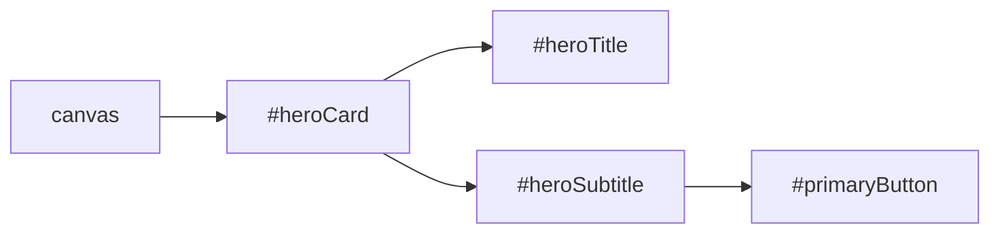

# 01 — Relational Positioning & DAG Resolution

TOAD features a constraint-based relational layout engine powered by a **Directed Acyclic Graph (DAG)** solver and topological sorting. This enables designers to position elements relative to one another semantically without calculating absolute pixel coordinates.

---

## 1. Relational Anchoring Grammar

The `at:` property positions an element relative to another element or boundary.

### Core Syntax:
```toad
at: <relation> <target> [offset <distance>] [align: <alignment>];
```

### Supported Relations & Targets:

| Relation | Description | Example |
|---|---|---|
| `below` | Places the top edge of this element below the bottom edge of target. | `at: below #heroImage offset 24px;` |
| `above` | Places the bottom edge of this element above the top edge of target. | `at: above #footer offset 16px;` |
| `right of` | Places the left edge of this element to the right of target's right edge. | `at: right of #sidebar offset 32px;` |
| `left of` | Places the right edge of this element to the left of target's left edge. | `at: left of #badge offset 12px;` |
| `center of` | Centers the element along horizontal and vertical axes within target. | `at: center of canvas;` |
| `inside` | Anchors to an inner corner or edge of a container. | `at: top-left inside #container offset 16px;` |

### Special Target Identifiers:
* `#elementId`: References any explicitly named element in the document.
* `canvas`: The root artboard.
* `parent`: The containing group or stack.
* `previous`: The immediately preceding sibling in document order.

---

## 2. Syntax Guardrail: No Colon After `offset`!

A common syntax error among developers and AI assistants is writing a colon after `offset`:

```toad
// ✅ Correct:
at: below #title offset 16px;
at: right of #avatar offset 12px align: center-y;

// ❌ Fatal Syntax Error:
at: below #title offset: 16px; // [TOAD-E001] Expected dimension after 'offset'
```

---

## 3. Edge Alignments

When positioning along one axis (e.g. `below`), you can align the perpendicular axis using `align:`:

```toad
text #subtitle {
    at: below #mainHeading offset 8px align: left-edge;
}

rect #actionBtn {
    at: below #subtitle offset 24px align: center-x;
}
```

### Supported Alignments:
* `left-edge` / `left`: Aligns left boundaries ($x_1 = x_2$).
* `right-edge` / `right`: Aligns right boundaries ($x_1 + w_1 = x_2 + w_2$).
* `center-x` / `center`: Centers horizontally relative to target.
* `top-edge` / `top`: Aligns top boundaries ($y_1 = y_2$).
* `bottom-edge` / `bottom`: Aligns bottom boundaries ($y_1 + h_1 = y_2 + h_2$).
* `center-y`: Centers vertically relative to target.

---

## 4. The 3-Color DFS DAG Solver (`dependencyGraph.ts`)

Before computing pixel coordinates, TOAD constructs a directed graph of all spatial dependencies:
* **Nodes**: Visual elements.
* **Edges**: Directed dependency from child to target ($A \to B$ if $A$ is positioned relative to $B$).

### Topological Sorting Algorithm
The solver uses a 3-color Depth-First Search:
* `WHITE`: Unvisited node.
* `GRAY`: Currently evaluating in active recursion stack.
* `BLACK`: Completely resolved and ordered.



### Cycle Detection & Prevention
If node $A$ depends on $B$, and $B$ depends on $A$, a cycle is detected when the DFS encounters a `GRAY` node:

```toad
// ❌ Circular Layout Dependency:
rect #boxA { at: below #boxB offset 10px; }
rect #boxB { at: below #boxA offset 10px; }
// Throws: Cyclic layout dependency cycle detected: #boxA -> #boxB -> #boxA
```

**Resolution Rule**: Break the cycle by anchoring the initial landmark element to absolute coordinates `(x, y)` or `center of canvas`, and chain dependent elements unidirectionally.
