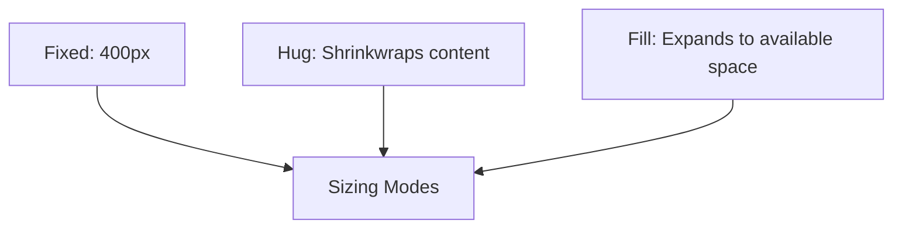

# 02 — Stacks & Auto-Layout System

Stacks provide Figma-like **Auto-Layout** capabilities. Instead of positioning each child element manually, a `stack` automatically calculates positions, spacing, wrapping, and container bounds based on dynamic child content.

---

## 1. Stack Declaration & Fundamentals

A `stack` organizes its children sequentially in a single direction.

```toad
stack #navbar {
    at: (40px, 40px);
    width: 820px;
    height: 64px;
    direction: horizontal;
    gap: 16px;
    padding: 0 24px;
    align-items: center;
    justify-content: space-between;
    background: #19271D;
    radius: 12px;

    icon #logo { size: 32px; iconName: "star"; fill: #87CC2E; }
    text #navTitle { content: "VARIO Nova"; font-size: 18px; color: #ffffff; }
    rect #ctaButton { size: 140px 36px; fill: #87CC2E; radius: 8px; }
}
```

---

## 2. Stack Properties & Layout Options

| Property | Values | Description |
|---|---|---|
| `direction:` | `horizontal`, `vertical` | Primary flow axis of children. |
| `gap:` | Dimension (e.g. `12px`, `24px`) | Uniform spacing between successive child elements. |
| `padding:` | Dimension, 2-tuple, or 4-tuple | Internal boundary inset around children. |
| `align-items:` / `align:` | `start`, `center`, `end`, `stretch` | Cross-axis alignment of children. |
| `justify-content:` / `justify:` | `start`, `center`, `end`, `space-between` | Main-axis distribution of children. |
| `wrap:` | `true` / `false` | Enables multi-line wrapping when children exceed width. |

---

## 3. Sizing Modes: `hug`, `fill`, and Fixed

Stacks and their child elements support three sizing modes:



### 1. `hug` (Auto-Sizing Content)
The container dimensions adjust automatically to enclose its children plus padding and gaps:

```toad
stack #tagPill {
    direction: horizontal;
    gap: 8px;
    padding: 6px 16px;
    size: hug hug; // Expands or contracts with text length
    background: alpha(#87CC2E, 0.15);
    radius: 16px;

    circle #statusDot { size: 8px; fill: #87CC2E; }
    text #tagLabel { content: "LIVE SESSION"; font-size: 11px; font-weight: 700; color: #87CC2E; }
}
```

### 2. `fill` (Flex Proportional Expansion)
A child element expands to consume all remaining available space along the parent stack's axis:

```toad
stack #cardHeader {
    width: 600px;
    direction: horizontal;
    gap: 16px;

    text #title {
        width: fill; // Takes all space not used by the badge
        content: "High-Throughput Streaming Engine";
        font-size: 20px;
    }

    rect #badge {
        width: 100px;
        size: 100px 28px;
    }
}
```

---

## 4. Nested Stacks: Building Complex UI

Nested stacks are the standard pattern for complex dashboards and cards:

```toad
stack #featureCard {
    width: 380px;
    height: hug;
    direction: vertical;
    gap: 16px;
    padding: 24px;
    background: #152018;
    stroke: alpha(#87CC2E, 0.2) 1px;
    radius: 16px;

    // Header sub-stack
    stack #cardHeader {
        direction: horizontal;
        justify-content: space-between;
        align-items: center;
        width: fill;

        icon #cardIcon { size: 24px; iconName: "cpu"; fill: #87CC2E; }
        rect #chip { size: 80px 22px; fill: alpha(#87CC2E, 0.12); radius: 11px; }
    }

    // Content
    text #cardTitle { content: "Neural Optimization"; font-size: 18px; font-weight: 700; color: #ffffff; }
    text #cardBody { content: "Sub-millisecond latency processing across distributed edge clusters."; font-size: 13px; color: #9EB0A3; line-height: 1.5; size: 332px; }
}
```
